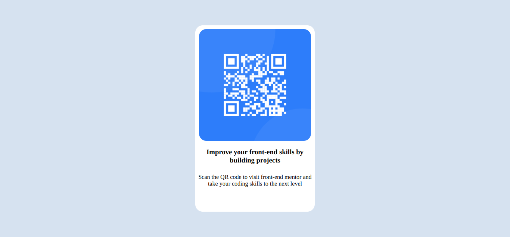

# Frontend Mentor - QR code component solution

This is a solution to the [QR code component challenge on Frontend Mentor](https://www.frontendmentor.io/challenges/qr-code-component-iux_sIO_H). Frontend Mentor challenges help you improve your coding skills by building realistic projects. 

## Table of contents

  - [Screenshot](#screenshot)
  - [Links](#links)
  - [Built with](#built-with)
  - [What I learned](#what-i-learned)
- [Author](#author)

### Screenshot

### Links

- Solution URL: (https://github.com/Jonniek01/-Frontend-Mentor---QR-code-component)
- Live Site URL: (https://qrcodecomponent0.netlify.app/)

### Built with

- Semantic HTML5 markup
- CSS custom properties
- Flexbox
- CSS Grid
- Mobile-first workflow

### What I learned

Building complex UI fast with CSS grids and flexbox

## Author

- Website -(https://jonn.netlify.app)
- Frontend Mentor - (https://www.frontendmentor.io/profile/Jonniek01)
- Twitter - (https://twitter.com/NdigirigiJ)

